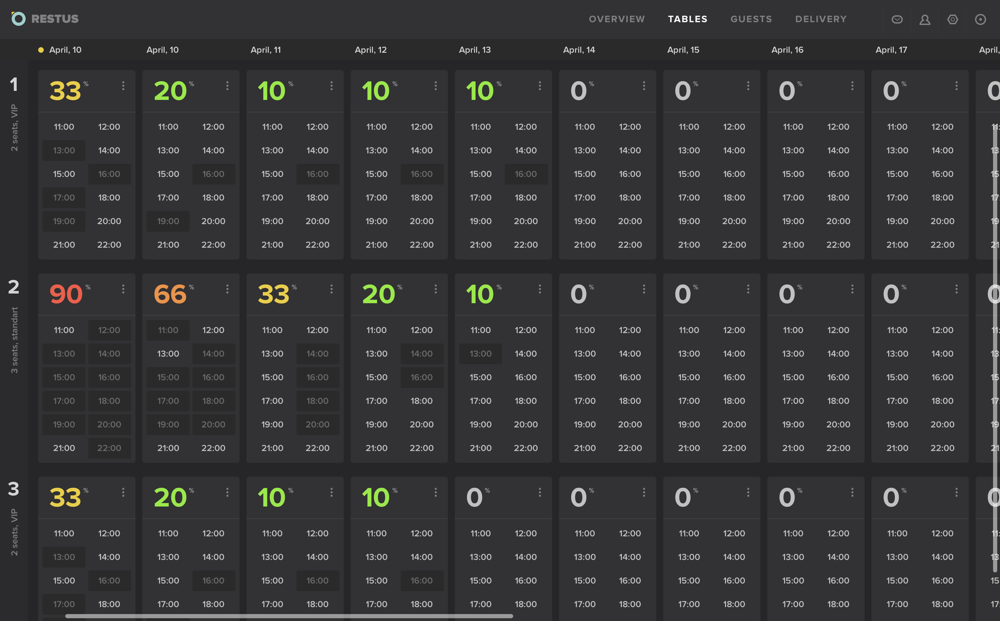

Тестовое задание на вакансию Frontend-разработчика
==========================================

В папке design находится вариант дизайна календаря, которым бы могли пользоваться сотрудники ресторанов для бронирования столиков. Необходимо превратить этот дизайн в react-компоненты.

Столбец с номерами столиков и строка с датами при прокрутке исчезать не должны.

Никаких ограничений на использование сторонних библиотек нет.

Если в условиях вам не хватает каких-то данных, опирайтесь на здравый смысл.

Результат разместите на GitHub или Bitbucket.

